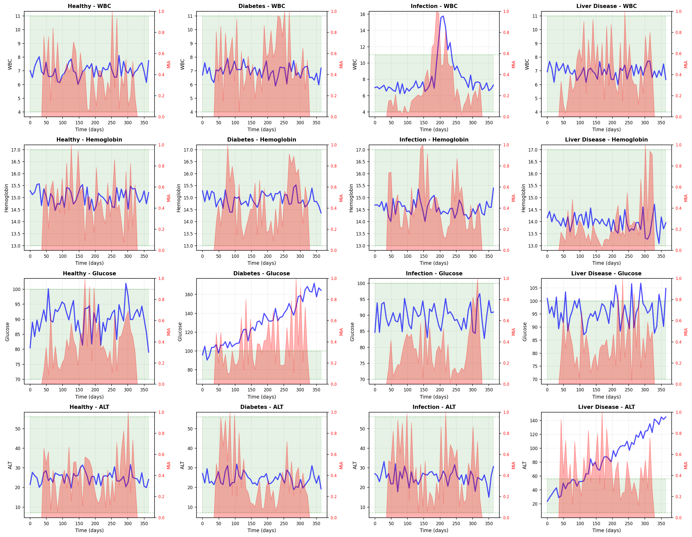
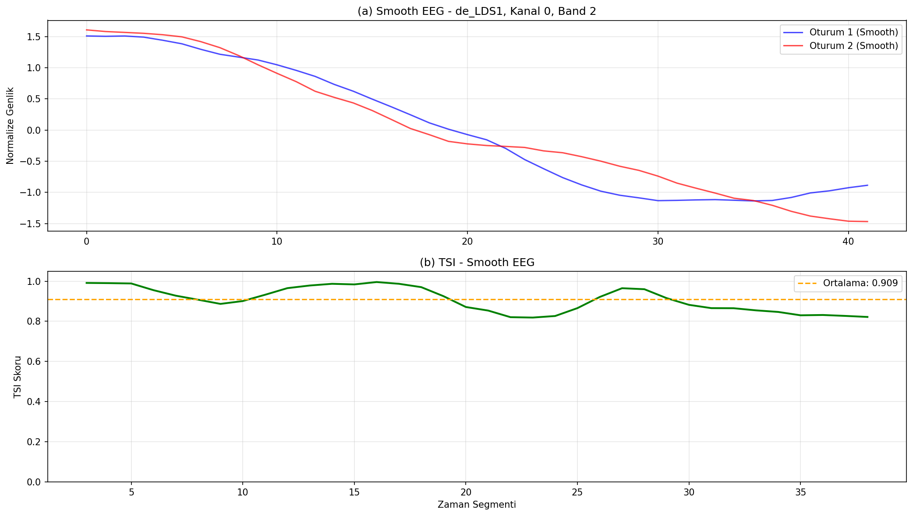

# Biomedical Signal and Health Data Analysis

TSI overcomes patient-to-patient calibration issues in clinical data by focusing directly on structural patterns rather than amplitude.

## 1. Long-Term Disease Progression (Blood Tests)
The TSI algorithm perceives deteriorations in patients' long-term blood values (WBC, Glucose, ALT) as "Trend Stress" (MIA), independently of reference ranges.

*Figure: Compared to healthy individuals; the dramatic spikes in the MIA (Disease Stress) area, shown in red, created by TSI during the development of Infection (WBC), Diabetes (Glucose), and Liver Disease (ALT).*

## 2. Neurological Patterns (EEG Dataset)
Our algorithm operates independently of the signal quality from clinical devices. 

*Figure: TSI demonstrating a high structural matching score of 0.909 on average across raw and smooth EEG signals taken from the SEED-IV dataset.*