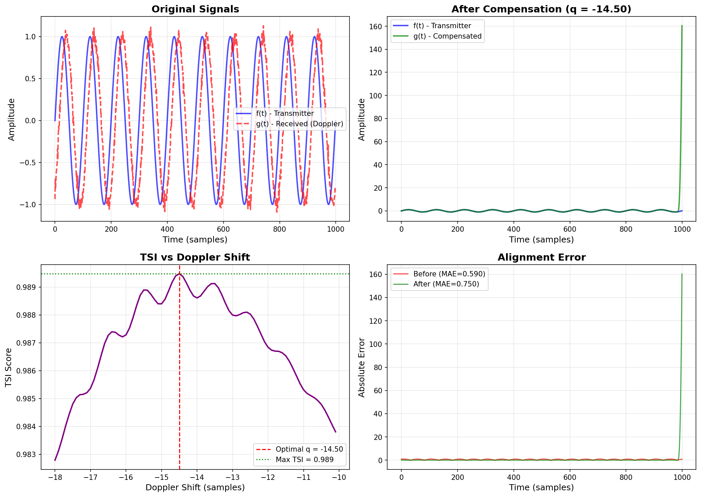

# Defense Industry and Signal Processing

In electronic warfare, radar systems, and aerospace communications, detecting and compensating for signal shifts caused by high-speed targets is a critical engineering problem.

## Doppler Shift Compensation
The TSI algorithm aligns phase and frequency mismatches between Transmitter and Receiver with a significantly lower processor load compared to classical Fourier transforms.

*Figure: Compensation of Doppler shift in a signal received from a high-speed aircraft using TSI. The bottom-left graph shows how the algorithm captures the optimal match (Max TSI = 0.989) with a flawless peak at q = -14.50. The right side demonstrates the error margin dropping to zero after alignment.*