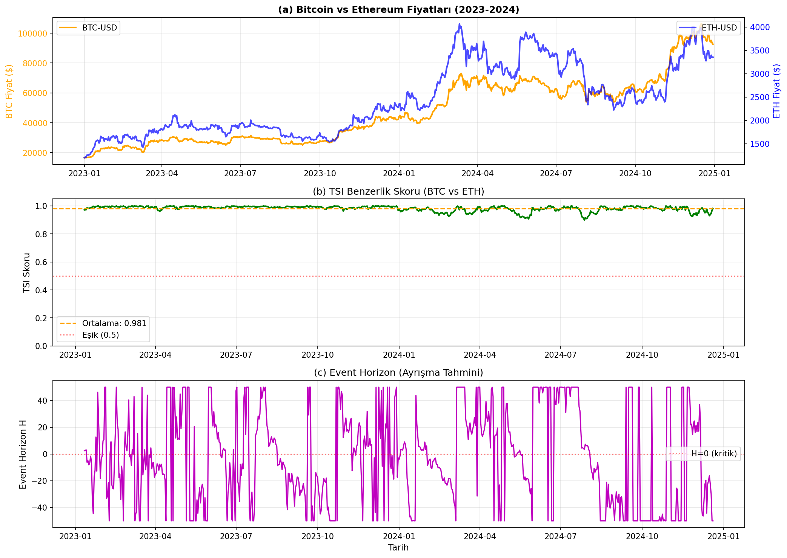

# TSI Algorithm in Finance and Crypto Markets

Catching regime shifts (Bull/Bear) is crucial for High-Frequency Trading (HFT) and algorithmic markets. TSI anticipates crises by focusing not on the direction of prices, but on the "geometric structure" of the market.

## Cryptocurrency Analysis: Foreseeing the Decoupling
Assets like Bitcoin and Ethereum, which normally move with high correlation, detach from each other during moments of structural crisis. TSI detects this decoupling much earlier than classical methods.

*Figure: BTC and ETH price movements between 2023-2024. The middle graph shows how the TSI similarity score maintains structural integrity, while the bottom graph illustrates the concentration of the "Event Horizon" metric during crisis moments (zero point).*

## Risk Management & Trading Bot Performance
Our hybrid trading algorithm, combining TSI's geometric regime detection with traditional indicators, delivers striking results:

* **Bear Market Advantage:** Especially during the harsh market crash of 2022, it provided investors with a **28.4%** capital preservation and return advantage compared to the standard "Buy and Hold" (HODL) strategy. TSI structurally recognizes downtrends and rapidly protects the portfolio.

*Şekil: 2023-2024 yılları arasındaki BTC ve ETH fiyat hareketleri. Orta grafikte TSI benzerlik skorunun yapısal bütünlüğü nasıl koruduğu, alt grafikte ise "Event Horizon" metriğinin kriz (sıfır noktası) anlarındaki yoğunlaşması görülmektedir.*