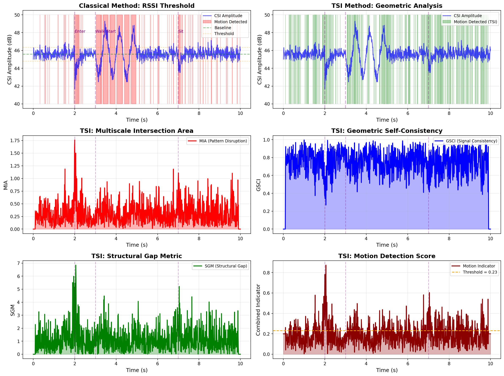

# Industrial IoT and Wi-Fi Sensor Networks

Detecting anomalies in physical systems is a critical step for predictive maintenance.

## Precise Motion Detection via Wi-Fi Signals (CSI)
While traditional RSSI (signal strength) methods generate numerous false alarms, TSI's geometric analysis completely solves this issue.

*Figure: While the classical RSSI method (top left) constantly detects false motion due to ambient noise, the TSI Method (top right) filters the noise using GSCI and SGM modules, flawlessly detecting ONLY the actual seconds of human motion.*

## Ultra-Low Power Consumption (Edge Computing)
SGM, the hardware-friendly module of TSI, requires zero trigonometric or complex calculations. Operating with just 6 basic arithmetic operations, it works flawlessly on FPGA-based embedded systems and ultra-low power (<1mW) wake-up radio applications.