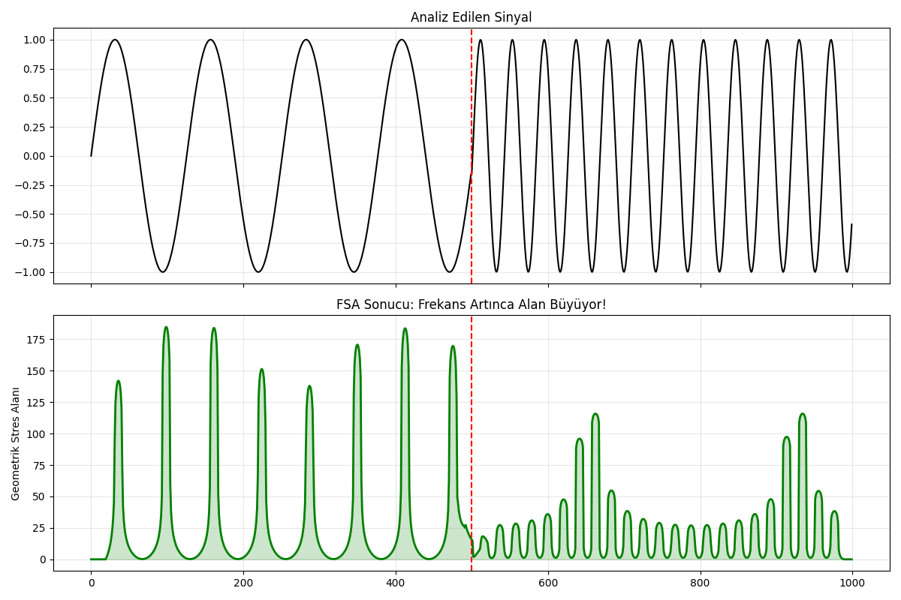
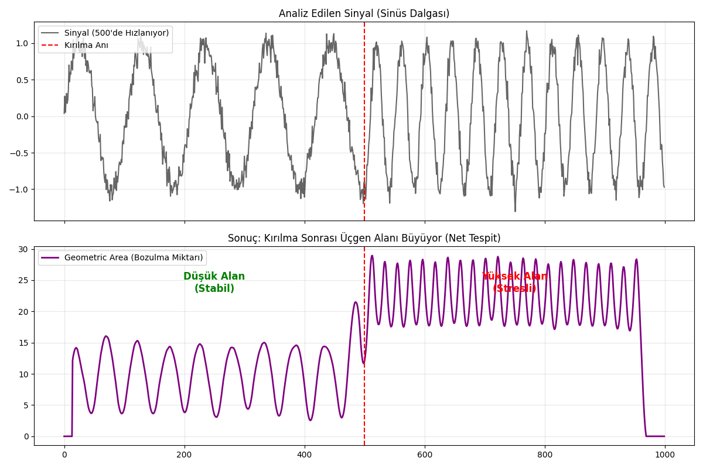

# Our Technology: Multiscale Geometric Analysis

The TSI architecture examines time series through the lens of **computational geometry** rather than classical numerical analysis. 

While the exact mathematical weighting and Laplace kernel formulations remain our commercial IP, the fundamental logic of the system rests on three main pillars:

---

## 1. Event Horizon & Multiscale Intersection Area (MIA)
When a system enters a crisis or a structural break, our algorithm calculates hidden "Intersection Triangles" formed by the divergence of the system's own micro, meso, and macro trajectories. Millisecond spikes in this area alert us to structural stress long before the actual crisis erupts.

*Figure 1: TSI's performance profile on noisy raw signals. The algorithm detects the breaking point in advance and warns that the system is about to change direction via the "Event Horizon" metric.*

## 2. Structural Gap Metric (SGM)
Optimized specifically for IoT devices and High-Frequency Trading (HFT) bots, this module instantly collides the system's forward and backward trend predictions. The vertical "structural gap" between them is the clearest evidence that the system is about to change frequency or direction. It operates with zero trigonometric functions, making it ultra-lightweight.

*Figure 2: The exact moment a synthetic wave changes frequency. The lower graph shows how the MIA module spikes instantly to warn the system of the structural disruption.*

## 3. The Ultimate Decision Engine: UGSI (Unified Geometric Stability Index)
For extreme noise environments and critical sensor networks, all our geometric modules (GSCI, MIA, SGM) merge under a single "Hyper-Metric". UGSI utilizes Bayesian weighting to analyze instantaneous jumps and structural bends simultaneously. This ensures flawless crisis detection reliability by **reducing the false alarm rate to near zero**.

---

## Enterprise Solutions & Integration

We offer API access and B2B consulting services to integrate the TSI framework into your company's sensor networks, algorithmic trading bots, or predictive maintenance systems.